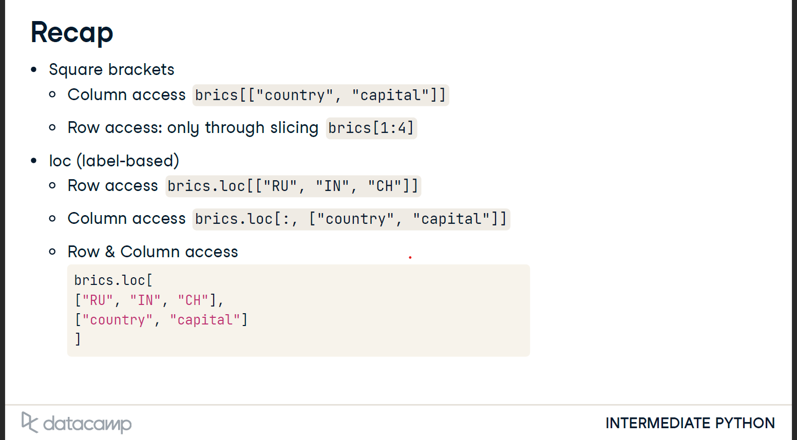

<p align="center">
  
</p>
<h1 align="center">Pandas</h1>

> it’s a High level data manipulation tool, and it’s a software library written for the Python programming language for data manipulation and analysis, we use it instead of creating data frames manually by dictionaries
> 
- **How to use it**
    
    ```python
    import pandas as pd
    ```
    
- **create data frame**
    - **we could create data frame from Dictionary:**
    
    ```python
    dict = {
    "country":["Brazil", "Russia", "India", "China", "South Africa"],
    "capital":["Brasilia", "Moscow", "New Delhi", "Beijing", "Pretoria"],
    "area":[8.516, 17.10, 3.286, 9.597, 1.221]
    "population":[200.4, 143.5, 1252, 1357, 52.98] }
    **brics = pd.DataFrame(dict)**
    ```
    
               **area           capital         country              population
    0         8.516         Brasilia         Brazil                 200.40
    1         17.100        Moscow       Russia               143.50
    2        3.286          New Delhi    India                 1252.00
    3         9.597         Beijing         China                 1357.00
    4         1.221         Pretoria       South Africa       52.98**
    
    **another Example:**
    
    ```python
    # Pre-defined lists
    names = ['United States', 'Australia', 'Japan', 'India', 'Russia', 'Morocco', 'Egypt']
    dr =  [True, False, False, False, True, True, True]
    cpc = [809, 731, 588, 18, 200, 70, 45]
    
    # Import pandas as pd
    import pandas as pd
    
    # Create dictionary my_dict with three key:value pairs: my_dict
    my_dict ={'country':names,'drives_right':dr,'cars_per_cap':cpc}
    
    # Build a DataFrame cars from my_dict: cars
    cars = pd.DataFrame(my_dict)
    
    # Print cars
    print(cars)
    ```
    
    - **we could add text index to the frame**
    
    ```python
    brics.index = ["BR", "RU", "IN", "CH", "SA"]
    brics
    ```
    
    - **we could take the values from CSV files as data frame:**
    
    <aside>
    💡 **CSV = “comma-separated values”**
    
    </aside>
    
    ```python
    **brics = pd.read_csv("path/to/brics.csv", index_col = 0) 
    # index_col we use to make the selected coulmn "0" is the index column
    print(brics)**
    ```
    
    - **to add a new column**
    
    ```python
    import pandas as pd
    cars = pd.read_csv('cars.csv', index_col = 0)
    cars["COUNTRY"] = cars["country"].apply(str.upper)
    print(cars)
    ```
    
- **Select the Data**
    - we could access **the column** like the list
    
    ```python
    Print(world["Name"] )
    #**type:**
    # pandas.core.series.Series
    ```
    
    > by this way we select **the coulumn as a series (”Array”)  - 1D array -** but if you want to select the coulms as Data Frame we put the coulmn in double bracitse
    > 
    
    ```python
    Print(world[["Name"]["age"]])
    #**type:**
    # pandas.core.frame.DataFrame
    ```
    
    - **Row Access:**
    
    ```python
    #to access the rows
    students[1:4]
    # This accesses from the second row to the fourth
    ```
    
- **loc / iloc**
    
    ## loc
    
    - we could access the data of detected row by loc as object
    
    ```python
    brics.loc["RU"]
    '''
    country Russia
    capital Moscow
    area 17.1
    population 143.5
    Name: RU, dtype: object
    '''
    ```
    
    - to get a data frame:
    
    ```python
    brics.loc[["RU"]]
    
    '''
    	  country  capital  area  population
    RU   Russia   Moscow   17.1   143.5
    '''
    ```
    
    - **we could select detected rows as Data Frames**
    
    ```python
    brics.loc[["RU", "IN", "CH"]]
    ```
    
           country    capital        area       population
    
    RU   Russia     Moscow    17.100         143.5
    IN    India      New Delhi   3.286         1252.0
    CH   China     Beijing         9.597        1357.0
    
    - **could select detected rows and detected coulmns**
    
    ```python
    brics.loc[["RU", "IN", "CH"], ["country", "capital"]]
    ```
    
            country    capital
    RU    Russia     Moscow
    
    In      India    New Delhi 
    
    CH     China     Beijing
    
    - to select all rows in detected coulmn
    
    ```python
    brics.loc[:, ["country", "capital"]]
    ```
    
    ## Iloc
    
    - **in Iloc we change the detected row or column with an index instead of text**
    
    ```python
    data.iloc[[1]]
    # instead of
    # data.loc[["RU"]]
    ```
    
    ```python
    data.iloc[[1,2,3]]
    # instead of
    # data.loc[["RU", "IN", "CH"]]
    ```
    
    
    
- **Filtering Data Frames**
    
    we could make condition on Data frame in 3 steps
    
    1. select the targeted column in variable
    2. Do comparison on targeted column
    3. Use result to select the needed columns from 
    
    **example:**
    
    ```python
    # select the targeted coulmn 
    brics.loc[:,"area"]
    # do the comparison on the coulmn 
    is_huge = brics["area"] > 8
    # get the rows under the conditions
    brics[is_huge]
    ```
    
    - we could make it in small line of code
    
    ```python
    brics[brics["area"]>8]
    ```
    
    and we could use **Boolean operations in the same way**
    
    ```python
    import numpy as np
    
    np.logical_and(brics["area"] > 8, brics["area"] < 10)
    ```