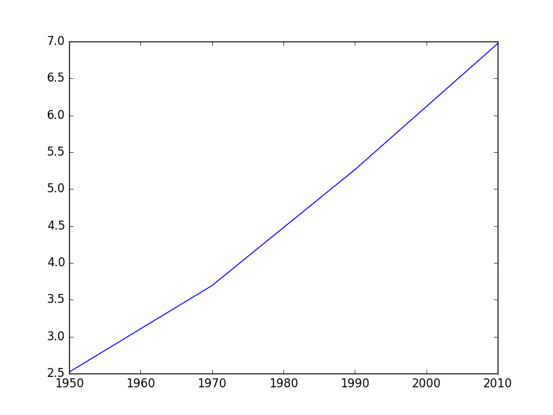

<p align="center">
  
</p>
<h1 align="center">Matplotlib</h1>

> Matplotlib is a plotting library for the Python programming language and its numerical mathematics extension NumPy, It provides an object-oriented API for embedding plots into applications using general-purpose GUI toolkits like Tkinter, wxPython, Qt,
> 

## resources for this library:

- [matplotlib](https://matplotlib.org/stable/users/index)

# Fundamentals:

- **how to use it ??**
    
    **how to import the library**
    
    ```python
    import matplotlib.pyplot as plt
    ```
    
    **how to show the plot ? an example of it** 
    
    ```python
    year = [1950, 1970, 1990, 2010]
    pop = [2.519, 3.692, 5.263, 6.972]
    plt.plot(year, pop)
    plt.show()
    ```
    
    **and its result:**
    
    
    
    and we need to know that there are a lot of types of plots:
    
- **Methods**
    
    to show the final result of the plot we use **show()** method
    
    ```python
    plt.show()
    ```
    
    to clean the plot up again so you can start afresh we use **clf()**
    
    ```python
    plt.clf()
    ```
    
- **Scatter Plot**
    
    it’s to show the data on the graph in only points
    
    **example:**
    
     
    
    ```python
    import matplotlib.pyplot as plt
    year = [1950,1970,1990,2010] 
    pop = [2.519,3.692,5.263,6.972]
    plt.scatter(year, pop)
    plt.show()
    ```
    
    
    
- **Histogram**
    
    **A histogram is a visual representation of the distribution of quantitative data.**
    
    we know the **distribution** of the data at detected area
    
    
    
    ```python
    values = [0,0.6,1.4,1.6,2.2,2.5,2.6,3.2,3.5,3.9,4.2,6]
    plt.hist(values, bins=3)
    plt.show()
    ```
    
- **plot customization**
    
    ## Axis Labels
    
    we could put text of x axis and y axis
    
    
    
    ```python
    import matplotlib.pyplot as plt
    year = [1950,1951,1952, ...,2100] 
    pop = [2.538,2.57,2.62, ...,10.85]
    plt.plot(year, pop)
    plt.xlabel('Year') 
    plt.ylabel('Population')
    plt.show()
    ```
    
    ## Title
    
    we put the detected title for the graph
    
    
    
     
    
    ```python
    plt.title('World Population Projections')
    ```
    
    ## Ticks
    
    to show the data in a detected range of values
    
    
    
    ```python
    plt.yticks([0,2,4,6,8,10],
    						['0','2B','4B','6B','8B','10B'])
    ```
    
    ## change the color of the plot and opacity
    
      where we use:
    
    C >> The color of the plot 
    
    alpha >> the opacity of the plot
    
    ```python
    
    plt.scatter(x = gdp_cap, y = life_exp, s = np.array(pop) * 2, c = col, alpha = 0.8)
    
    ```